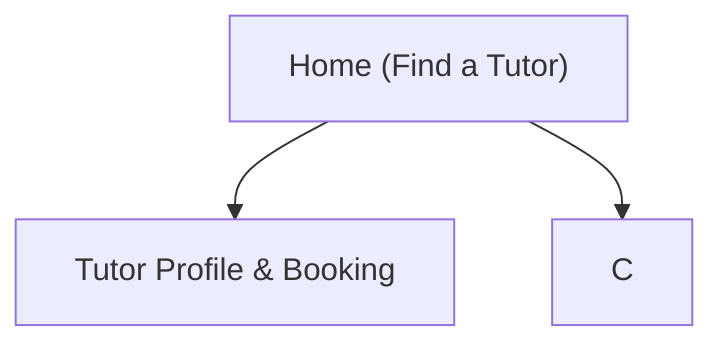

## 1. Product Overview

PrepVilla is a verified-teacher marketplace where students find, message, and book lessons with vetted tutors.
It helps students trust who they’re hiring and helps tutors manage onboarding, availability, and bookings.

## 2. Core Features

### 2.1 User Roles

| Role                     | Registration Method                 | Core Permissions                                                                          |
| ------------------------ | ----------------------------------- | ----------------------------------------------------------------------------------------- |
| Student                  | Email/phone + password (web/mobile) | Search tutors, view profiles, request bookings, message tutors, manage bookings           |
| Tutor (Verified Teacher) | Register + submit verification      | Create tutor profile, set availability, accept/decline bookings, message students         |
| Admin                    | Staff-created account               | Review/approve/reject verification, moderate profiles, manage disputes/basic user actions |

### 2.2 Feature Module

Our PrepVilla requirements consist of the following main pages:

1. **Home (Find a Tutor)**: search bar, filters, tutor results list, login entry.
2. **About PrepVilla**: mission, trust principles, learning journey, and pathways for students and tutors.
3. **Tutor Profile & Booking**: tutor details, verification badge/status, availability preview, booking request.
4. **Dashboard (Student/Tutor)**: bookings list, booking details actions, messages, profile management.
5. **Login & Sign up**: authentication, password reset, role selection for tutor onboarding.
6. **Admin Verification**: verification queue, application review, approve/reject with notes.

### 2.3 Page Details

| Page Name                 | Module Name          | Feature description                                                                                                             |
| ------------------------- | -------------------- | ------------------------------------------------------------------------------------------------------------------------------- |
| Home (Find a Tutor)       | Search & Filters     | Search by subject/keyword and filter by price range, level, language, timezone, availability window.                            |
| Home (Find a Tutor)       | Tutor Results        | Display tutor cards with name, subjects, short bio, price, verification badge, next available slot; open profile.               |
| Home (Find a Tutor)       | Navigation           | Provide entry points to Login/Sign up and Dashboard (if authenticated).                                                         |
| About PrepVilla           | Mission & Trust      | Explain PrepVilla’s purpose, verification approach, learning journey, and value for students and tutors.                        |
| Tutor Profile & Booking   | Tutor Profile        | Show bio, subjects, education/credentials summary, teaching languages, timezone, rates, verification badge + “what this means”. |
| Tutor Profile & Booking   | Availability Preview | Show upcoming available slots (read-only preview) and allow selecting a preferred slot/time range for a request.                |
| Tutor Profile & Booking   | Booking Request      | Create booking request with lesson type, requested time/slot, notes; show request status updates.                               |
| Tutor Profile & Booking   | Messaging Entry      | Start/continue conversation with the tutor tied to booking context.                                                             |
| Dashboard (Student/Tutor) | Booking Management   | List bookings by status (requested/confirmed/completed/cancelled); view details; cancel (rules-based) and update notes.         |
| Dashboard (Student/Tutor) | Messages             | Show conversation list and real-time chat view; send/receive messages; mark read.                                               |
| Dashboard (Student/Tutor) | Student Profile      | Manage basic profile fields (name, timezone, learning goals).                                                                   |
| Dashboard (Student/Tutor) | Tutor Onboarding     | Submit/track verification (documents + form); publish/unpublish tutor profile based on status.                                  |
| Dashboard (Student/Tutor) | Tutor Availability   | Create/edit availability slots; prevent overlaps; reflect changes in booking flow.                                              |
| Login & Sign up           | Authentication       | Sign up/in, logout, password reset; enforce email/phone verification if enabled.                                                |
| Login & Sign up           | Role Selection       | Let users choose Student vs Tutor path; route tutors into onboarding if unverified.                                             |
| Admin Verification        | Verification Queue   | List submissions with status and key metadata; open submission details.                                                         |
| Admin Verification        | Review Actions       | Approve/reject with notes; update tutor visibility and audit trail.                                                             |

## 3. Core Process

**Student Flow**: You open Home, search/filter tutors, open a tutor profile, request a booking (select slot or time range + notes), then message to coordinate. You manage upcoming and past bookings from the Dashboard.

**Tutor Flow**: You sign up as a tutor, submit verification and profile details, set availability, then respond to booking requests (accept/decline) and message students. Your profile is visible as “verified” after approval.

**Admin Flow**: You open Admin Verification, review submitted documents/details, approve or reject with notes, and the tutor’s marketplace visibility updates accordingly.

